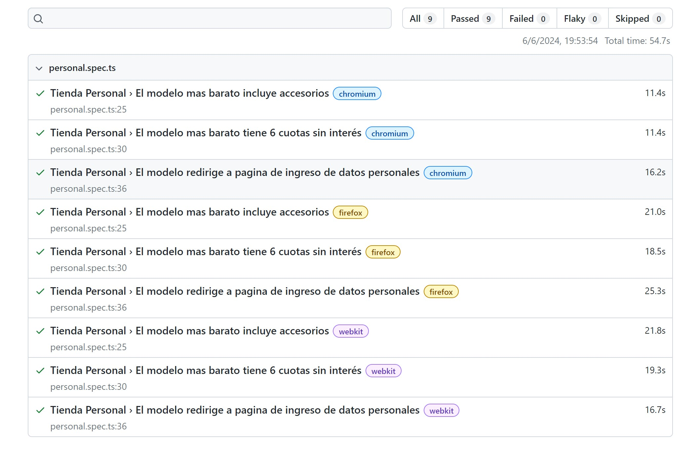

# Ejercicio de Pruebas de Software — Tienda Personal

Este repositorio es un ejercicio de la materia Pruebas de Software de la carrera de Desarrollo de Software de ISTEA. Se detallan los casos de prueba a ser desarrollados y un uso básico del framework utilizado.

## Casos de prueba

### Tienda personal: Item Moto Edge 40

**Descripción:** Se va a comprar el Edge 40 más barato en tienda.personal.com.ar

**Resultado esperado:** Que el producto incluya accesorios, que se pueda pagar
  en 6 cuotas sin interes, y que al presionar comprar se redirija al formulario
  de datos personales.

**Pasos a seguir:**    
  - Ingrese a https://tienda.personal.com.ar/
  - Busque el Edge 40
  - Ordenar por más barato
  - Verificar que el más barato tenga el texto 'Incluye accesorios'
  - Verificar que además se pueda pagar en 6 cuotas sin interes
  - Presionar comprar y verificar que redirige al formulario de datos personales.

### Tienda Personal: Impacto de cambio de color en link de compra

**Descripción:** Se verificará que el cambio de color de un celular cambie se efectúe correctamente y aplique en la redirección de la compra.

**Resultado esperado:** Al seleccionar Rojo, debe cambiar el label, aplicar parámetro en la url y agregar el string 'red' en el string de compra.

**Pasos a seguir:**
  - Ingrese a https://tienda.personal.com.ar/
  - Ingresar a celulares.
  - Filtrar por Apple.
  - Seleccionar el 'iPhone 13 256 GB'.
  - En el detalle de item seleccionar el color rojo.
  - Verificar cambie el atributo de color por 'red'.
  - Verificar que agregue la etiqueta 'red' al dom.
  - Presionar comprar y verificar que la url destino almacene el color en el URI.

## Uso del framework Playwright y ejecución de pruebas

[Playwright](https://playwright.dev/) es un framework para pruebas y automatización web. Permite testear [Chromium](https://www.chromium.org/Home), [Firefox](https://www.mozilla.org/en-US/firefox/new/) y [WebKit](https://webkit.org/) en una misma API.

Para ejecutar las pruebas, puedes utilizar el siguiente comando:

    npx playwright test

Este comando ejecutará los tests y disponibilizará los resultados con cada browser dentro del reporte alojado en la carpeta **playright-report** en formato HTML.

